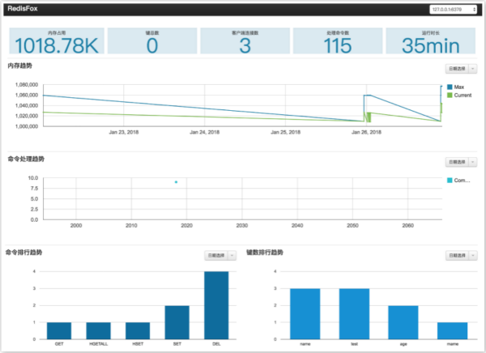

# RedisFox

## 简介

RedisFox是一款基于Golang开发的Redis可视化监控工具。



## 安装及运行

假设你已经配置好Golang环境（作者用的是Go1.9.2环境）

1. 下载RedisFox

```
git clone https://github.com/zer0131/RedisFox.git
```

2. 安装golang.org/x/net/context包

去[https://gopm.io/](https://gopm.io/)下载压缩包，解压后，将文件夹中的内容复制到 **src/golang.org/x/net/** 目录下（没有目录自行创建）

3. 获取其他依赖包

```
sh getall.sh
```

4. 安装

```
sh install.sh
```

5. 运行

在 **conf/redis-fox.yaml** 配置redis服务器，并开启redis，然后执行start.sh脚本

```
sh start.sh
```

6. 访问

打开浏览器访问 **http://127.0.0.1:8080** 即可查看redis的监控状态

7. 停止

```
sh stop.sh
```

## 目录介绍

```
├─bin                    go编译后执行文件目录
├─pkg                    go编译使用的包目录
├─src                    源文件
│  ├─redisfox            源代码
├─conf                   配置文件目录
│  ├─redis-fox.yaml      配置文件
├─log                    日志目录
├─data                   数据目录
├─static                 静态资源目录
├─tpl                    模板目录
├─getall.sh              获取go依赖脚本
├─install.sh             程序编译安装脚本
├─start.sh               程序运行脚本
├─stop.sh                程序停止脚本
└─redisfox.png           程序网页截图
```

## 配置说明

配置基于yaml语法，不懂戳这里[http://www.ruanyifeng.com/blog/2016/07/yaml.html](http://www.ruanyifeng.com/blog/2016/07/yaml.html)

```
#!同级的字段缩进相同，且只能用空格缩进
#!每个字段value值前相对“-”或者“：”必须有空格

#[redis服务相关配置]

#redis服务器
servers:
 - server: 127.0.0.1
   port: 6379
   conntype: tcp

#获取redis信息间隔时间(秒)
sleeptime: 30

#redis连接池最大连接数
maxidle: 3

#redis连接池最大活跃数,0表示无限制
maxactive: 3

#redis连接池连接超时时间,0表示不超时
idletimeout: 0

#存储数据类型
datatype: sqlite
#数据存储路径
datapath: ./data/redisfox.db

#日志相关
logpath: ./log/
logname: redisfox.log
loglevel: 4

#web访问ip
serverip: 127.0.0.1
#web访问端口
serverport: 8080

#静态文件目录
staticdir: ./static/
#模板文件目录
tpldir: ./tpl/
```


